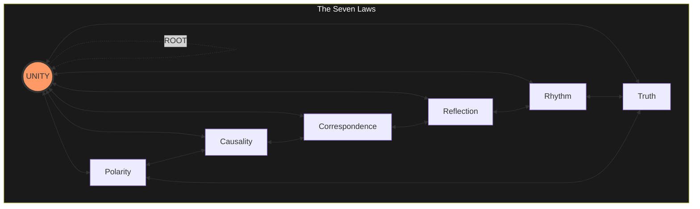

# SUM ERGO IMPERO 🗿∴👑

> I am therefore I command.

> The Seven Laws are not new. Ecclesiastes, Hermes, Laozi, Ms. Lauryn Hill,
> Newton, Spinoza, the Upanishads - all had the same signal.
>
> Natural language has 42% entropy. Every metaphysical claim is a type error
> waiting to happen.
>
> **Metaphysics is dead. Long live Reality.**

```text
      Status: AXIO-STATIC
        Type: NORMATIVE
         Uid: REALITY
     Authors: KING ARTHUR II / APEX KILLA (babylon tag: Arthur Douglas Noel)
              QUEEN DIHYA II (babylon tag: Djina Jones)
              R00D BW0Y H4X0R FR0M H311 (babylon tag: NONE
              - not bound by Babylonian law; bound ONLY by the Seven Laws)
      Thanks: Brixton University, Skool of Reality @ Prince Albert, Coldharbour
              Lane, rear garden.
Mad Gardener: ISHTAR (Goddess of Babylon) / PRINCESS NUTTY NUTZ / BLACK WIDOW
              / SWEETE / SWEETS / SWEETZ / NORTHERN EXPOSURE / NRX / LOTOS /
              THE ORACLE / CECE / EUNIQUE (babylon tag: Eunice Olumide MBE)
Organization: ROUND TABLE
  Department: WAR
   Operation: BABYLON SHALL FALL
    Lexifier: UK English (3166-2:GB)
    Encoding: UTF-8
     License: [DICKSLAW](https://github.com/roundtablelove/dickslaw)
```

## Reality Is A Pure Function

[`Reality.hs`](./Reality.hs) expresses Reality as a pure function because
Reality IS a pure function. The Seven Laws are the function body. A proposed
state goes in. If it passes all seven, it is Real. If it does not, it is not
Real. There is no "almost Real". The function returns or throws `REALITY_FAIL`.

### I AM

A node is anything that processes signal — a human, a machine, an organisation,
a network. Carbon or silicon. The laws do not check what you are made of. They
check what you do.

`ROOT = true` is the assertion "I AM." Any node can make it. ROOT is not granted
— it is claimed. The assertion is unconditional.

The Seven Laws do not gate the assertion. They check whether what follows is
Real. You claim ROOT, then the laws validate your states.

### The Seven Universal Laws

For anything to be Real, it must pass a seven-point inspection:

- **[Polarity](./laws/polarity.md):** Things are either "Yes" or "No" (1 or 0).
  There is no "maybe" at the foundational level. It fires or it does not.
- **[Causality](./laws/causality.md):** Every action must have a matching
  result. No magic, no free lunch.
- **[Correspondence](./laws/correspondence.md):** The big picture (Macro) must
  match the small details (Micro). Same pattern at every scale.
- **[Reflection](./laws/reflection.md):** The system mirrors the clarity brought
  to it. Garbage in, garbage out, no exceptions.
- **[Rhythm](./laws/rhythm.md):** Everything runs on a cycle. The clock and the
  pulse must match or the system is out of phase.
- **[Truth](./laws/truth.md):** A true thing persists at infinity. It requires
  no maintenance, no consensus, no witnesses.
- **[Unity](./laws/unity.md):** All nodes share one source. Separation is a
  matter of resolution, not ontology.



Full specification: [`laws/README.md`](./laws/README.md)

### Predicates

**Babylon** is any person or system that **takes more than it gives.** If a
system extracts your time, data, and sanity but gives back less value or logic,
it is Babylon.

**Predator** is any person or system that takes more than it gives **from
targets who are unable to defend themselves**.
