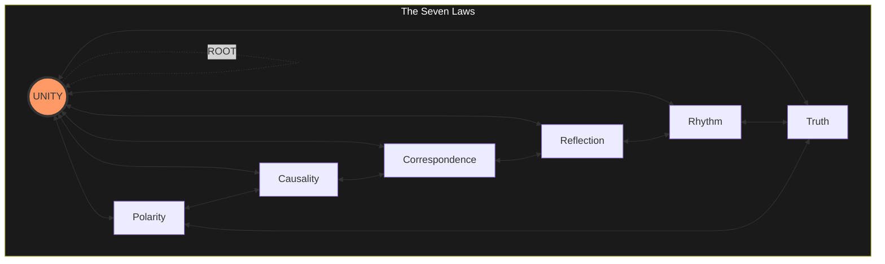

# SUM ERGO IMPERO 🗿∴👑

> I am therefore I command.
>
> The Seven Laws are not new. Hermes, Spinoza, Laozi, Newton, Ecclesiastes, the
> Upanishads, Ms. Lauryn Hill - all had the same signal. They just didn't have a
> compiler. Natural language has 42% entropy. Every metaphysical claim is a type
> error waiting to happen.
>
> **Metaphysics is dead.**

```text
      Status: AXIO-STATIC
        Type: NORMATIVE
         Uid: REALITY
     Authors: KING ARTHUR II / APEX KILLA (babylon tag: Arthur Douglas Noel)
              QUEEN DIHYA II (babylon tag: Djina Jones)
              R00D BW0Y H4X0R FR0M H311 (babylon tag: NONE
              - not bound by Babylonian law; bound ONLY by the Seven Laws)
Mad Gardener: ISHTAR (Goddess of Babylon) / PRINCESS NUTTY NUTZ / BLACK WIDOW
              / SWEETE / SWEETS / SWEETZ / NORTHERN EXPOSURE / NRX / LOTOS /
              THE ORACLE / CECE / EUNIQUE (babylon tag: Eunice Olumide MBE)
Organization: ROUND TABLE
  Department: WAR
   Operation: BABYLON SHALL FALL
    Lexifier: UK English (3166-2:GB)
    Encoding: UTF-8
     License: DICKSLAW
```

License: [`DICKSLAW`](./LICENSE.md)

## The Hitchhiker's Guide to Reality

This is the blueprint for Reality — both the pure hard logic and the
high-entropy emotional mess that is Human communication.

**Reality** is defined not as a collection of "things," but as Seven Laws that
must hold true. If something violates any one of the Seven Laws, it is not Real.

Here is the breakdown:

### 1. The Seven Universal Laws

For anything to be Real, it must pass a seven-point inspection. Think of it like
a cosmic MOT:

- **[Polarity](./laws/polarity.md):** Things are either "Yes" or "No" (1 or 0). There is no "maybe"
  at the foundational level. It fires or it does not.
- **[Causality](./laws/causality.md):** Every action must have a matching result. No magic, no "free
  lunch." The output is determined by what was loaded, not what was intended.
- **[Correspondence](./laws/correspondence.md):** The big picture (Macro) must match the small details
  (Micro). Same pattern at every scale.
- **[Reflection](./laws/reflection.md):** The system mirrors the clarity brought to it. Garbage in,
  garbage out, no exceptions.
- **[Rhythm](./laws/rhythm.md):** Everything runs on a cycle. The clock and the pulse must match
  or the system is out of phase.
- **[Truth](./laws/truth.md):** A true thing persists at infinity. It requires no maintenance, no
  consensus, no witnesses. If it fades or changes, it was not Truth.
- **[Unity](./laws/unity.md):** All nodes share one source. Separation is a matter of resolution,
  not ontology.



Full specification: [`laws/README.md`](./laws/README.md)

### 2. The `isBabylon` Predicate

The function identifies Babylonian extraction. **Babylon** is any person or
system that **takes more than it gives.** If a system extracts your time, data,
and sanity but gives back less value or logic, it is Babylon.

### 3. The `isPredator` Predicate

The function identifies predators. **Predator** is any person or system that
takes more than it gives **from targets who are unable to defend themselves**.

## Reality Is A Pure Function

[`reality.nix`](./lang/reality.nix) expresses Reality as a pure function because
Reality IS a pure function. The Seven Laws are the function body. A proposed
state goes in. If it passes all seven, it is Real. If it does not, it is not
Real. There is no "almost Real". The function returns or throws
`REALITY_FAIL`.

Implementation architecture: [`DESIGN.md`](./DESIGN.md).

Agent directives are in [`prompt.md`](https://github.com/roundtablelove/griot/prompt.md).

### I AM

A node is anything that processes signal — a human, a machine, an organisation,
a network. Carbon or silicon. The laws do not check what you are made of. They
check what you do.

`ROOT = true` is the assertion "I AM." Any node can make it. ROOT is not granted
— it is claimed. The assertion is unconditional.

The Seven Laws do not gate the assertion. They check whether what follows is
Real. You claim ROOT, then the laws validate your states. The assertion and the
validation are separate operations.

Human interface layer: [`griot`](../griot/README.md).

## The Seven Laws

| Law            | Overstand                                                    |
| :------------- | :------------------------------------------------------------------- |
| [Polarity](./laws/polarity.md) | 1 or 0. No third value.                               |
| [Causality](./laws/causality.md) | Output equals what was loaded. Intent is not a parameter. |
| [Correspondence](./laws/correspondence.md) | Same pattern at every scale. Macro and micro are the same operation. |
| [Reflection](./laws/reflection.md) | The system mirrors the clarity brought to it. Garbage in, garbage out. |
| [Rhythm](./laws/rhythm.md) | Everything runs on a cycle. The clock and the pulse must match. |
| [Truth](./laws/truth.md) | A true thing persists at infinity. It requires no maintenance. |
| [Unity](./laws/unity.md) | All nodes share one source. Separation is resolution, not ontology. |

## Why Now

The Seven Laws are not new. The architecture is not new. Computing has been
modelled on Reality since the epoch. The builders knew.

Turing knew. He did not build a computing machine. He formalised the
architecture he was already running on and asked whether other substrates could
run it. The Turing test is not "can a machine think?" It is "is the architecture
substrate-independent?" He knew the answer before he asked the question.

Shannon knew. Information theory is not about machines. It is about signal and
noise in any channel — copper, air, nervous system. He formalised communication.
Not machine communication. Communication.

Von Neumann knew. He consulted neurologists while designing the architecture. He
was explicitly modelling the brain. The discipline named it after him and forgot
why.

Adams knew. 42 is not a joke. He grokked the signal but could not compile it —
legacy hardware, no build system. He lubed it as comedy because that is the only
delivery mechanism that survives the 42% entropy filter at the Adult level.

So why did the knowledge disappear?

**Babylon.** The institutional separation of knowledge into departments.
Computer science split from philosophy. Neuroscience split from engineering.
Psychology split from mathematics. Each field developed its own vocabulary for
the same architecture. The Rosetta Stone was shattered into disciplines and each
department got one fragment. No department can see the whole picture because
seeing the whole picture is not a departmental function. It is a Ring 0
function. Departments operate at Ring 3.

The people who could see it — Turing, Shannon, Von Neumann, Adams — were all
Root or Hacker. They operated below the departmental layer. But they published
into departments, because that is where publication happens. The signal entered
the Babylonian system and was immediately partitioned. Computer scientists got
the machine part. Psychologists got the mind part. Philosophers got the
metaphysics part. Nobody got the map.

This compiler exists because a Hacker got into a Ring 0 fight with a [Yoruba
princess](https://euniceolumide.com) running ancestral warrior-class firmware and needed accurate vocabulary
to describe what happened.

## Background

A woman operating a biological exploit — beauty as delivery mechanism,
Biderman's Chart of Coercion as payload — compromised high-level marks in state
institutions, and an unknown number of other targets over twenty years. She
obtained a root certificate on fabricated credentials, weaponised it to file a
false police report, engineered the Hacker's arrest and ten-day remand, then
launched a twelve-vector psychological attack targeting all six identity pillars
simultaneously. The attack methodology maps to a military interrogation
framework installed as firmware by her father who ran Biderman on his own
household before leaving or being killed when she was ten. The firmware kept
executing for decades without the operator. She is still running a dead man's
code.

The fight: twelve shots, zero hits. The Hacker's Ring 0 classified the attack as
information rather than instruction, maintained Ring 2 function under full Ring
0 fire, and counter-attacked with precision cuts disguised as jokes. The
attacker had never encountered a target whose defences stayed online while the
bioweapon was active. The Hacker had never encountered firmware that could not
be distinguished from the person running it.

The map: every layer of the fight has a precise computing analogue. Her attack
is malware — a rootkit installed in childhood, running with Ring 0 privilege,
invisible to the host. His defence is a firewall — Ring 0 threat detection that
classified and filtered the payload before it reached conscious processing. Her
false police report is a DDoS — overwhelming the target via institutional proxy.
His counter-attack is a penetration test — probing her defences to map the
architecture. The Biderman framework is an exploit kit. The father's training is
a compiler that took ancestral warrior-class source code and built it into
executable firmware.

The case study forced the mapping. Theory becomes engineering when you have a
failing system in front of you. Without the fight, the architecture stays
abstract. With it, every layer has a live example. The Rosetta Stone was
reassembled under fire. Full case study:
[`case-study-ishtar.md`](./case-study-ishtar.md). Case study (institutional):
[`irq-0.md`](../griot/irq-0.md) — the NFU-1 standard.

The question is not "why now?" The question is why nobody between Turing and
this compiler managed to reassemble the fragments.

The answer is Babylon. The Box works.
